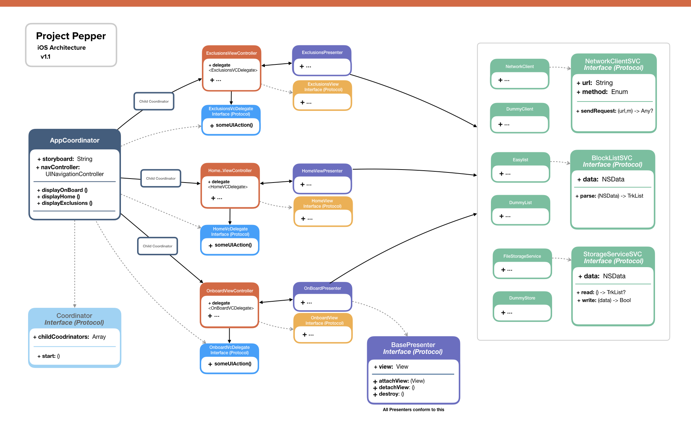

# Project Pepper - Technical Document
**Author:**  Daniel Bernal  
**Project:**  Codename **¨Pepper¨**.  A Safari tracker blocker for iOS 
Version: 1.1

## Functional Requirements

### Minimum viable product (v1.0)

#### 1) Safari (iOS) Content Blocker Extension
Content filtering should be handled by a Safari content blocker extension. _(See: Content Blocker on Technical Implementation)_

#### 2) Updates from publicly available tracker block lists
Users should be able to update the tracker block lists from the main interface of the app.   These updates should be immediately reflected as actions in the content blocker extension source files.   

- Version 1.0 should support the privacy/whitelist list from [EasyList](https://easylist.to/)
- Upcoming versions should support both privacy and whitelists lists from [Disconnect.me](https://github.com/disconnectme/disconnect-tracking-protection)

#### 3) Allow users to White-list websites from the app main screen
Users should be able to white-list websites using manually managed list of domains.

#### 4) Provide a UI for displaying setup instructions. (Onboarding)
App should feature an onboarding tutorial to explain users about the extension installation, and confirm when the extension is properly installed in the browser.

#### 5) Cross promote DuckDuckGo Search
After installation, the application should cross promote DDG search as an alternative and provide instructions to configure it as the default search engine in Safari.

### Backlog (Coming up in later releases)

#### 1) Automatic/Background updates
The app should update the tracker lists automatically in the background.  This could be delivered via locally scheduled or push notifications.

#### 2) iPad Compatibility
Additional UI for iPad should be provided, so the application takes advantage of the iPad hardware (Screen)

#### 3) Multiple List Parsing and Support
Generate rules from different lists and support user imported block lists

## Technical Implementation

### General Details

**Resulting Product:**  Mobile App + Safari Content Blocker extension  
**Platform:** iOS  
**Version** 13 or higher  
**Development Language:** Swift 5  
**Third Party Dependencies:** Lottie (Via SPM) 

### Content Blocker
Safari content blocker extensions are solely based on actions, triggered by specific content in the rendered page, allowing the app to customize the way Safari handles specific content.   Tracker blocking should be implemented via a custom extension.

For additional information on Safari Extensibility and content blocking, please refer to:

- [Safari Extensibility: WWDC 2015 - Video](https://developer.apple.com/videos/play/wwdc2015/511/)
- [Creating a Content Blocker](https://developer.apple.com/documentation/safariservices/creating_a_content_blocker#//apple_ref/doc/uid/TP40016265)
- [App Extension Programming Guide: Content Blocker](https://developer.apple.com/library/archive/documentation/General/Conceptual/ExtensibilityPG/ContentBlocker.html)

### Required Infrastructure (Server Side)
The App is standalone and requires no server-side processing or custom infrastructure.

Tracker lists will be hosted on a CDN for scalability purposes, except during development and testing phases, where lists will be hosted at Amazon S3.

### Application Architecture
The application architecture is based on MVP pattern supported by Coordinators.

Download [PDF](docs/architecture.pdf) or [Keynote](docs/architecture.key) Version

#### Advantages of this approach:
- Straightforward and fast implementation (Compared to MVVM, VIPER).
- Fast Learning curve.
- Good separation of concerns around single responsibility principles.
- Easy to understand codebase, with smaller boilerplate.
- Navigation is decoupled from ViewControllers.
- Code is Easily Testable.
- Dependency injection is managed at the coordinator level.

#### Additional info on Components:

**AppCoordinator && Child Coordinators:**:  (The heart of the app)

- Implements the Coordinator Protocol, which defines the navigation interface.
- Manages the app's navigation, serving as router between modules.
- Each section of the app is driven by Child Coordinators following the same pattern.

**Views**: Dumb views responsible for:

- Enable user interactions and displays the domain model.   
- Each view relies on a single Presenter class, and conforms to its own protocol.

**Presenters**: Handles Business logic and communication between views and services.

**NetworkClient**: Handles networking tasks

**BlockListService**: Handles list download, update and management

**Storage Service**: Handles storage for parsed tracker lists.

### Testing & Automation
Components should be Unit Tested, (at least for major features), based on the following considerations:

1. Test Cases should be formally defined
2. Manual Testing for tracker blocking functionalities
3. Manual Testing for all in-app features is required
4. Automated Unit Testing for components (Models, and services at the minimum) using XCTest and injected mocked dependencies.
5. Automated UI Testing for Major functionalities (Not considered for this phase of the project)

#### Automation & Distribution
Code Signing and beta delivery should be handled automatically via Fastlane, including.

- Building the application
- Code Signing
- Test Run
- Screenshots capture (Optional)
- Beta distribution via TestFlight or Crashlytics
