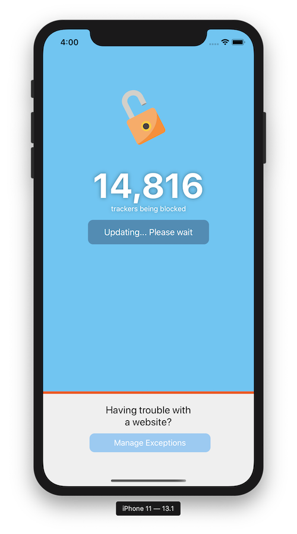

# Pepper
A simple tracker blocker extension for Safari in iOS that takes advantage of open source tracker lists to deliver privacy protection.  This project was developed as en experiment with the coordinator pattern in iOS.

**Here is how it looks:**



More Screenshots available [here](Docs/screenshots/).

## Architecture and Design
The app follows an MVP pattern supported by Coordinators.   For additional details, please refer to the [architecture and technical docs](Docs/architecture.md).

## Building
Project uses Swift Package Manager for dependency management.  So just fire up XCode and hit build.

*Note:*  The application relies on App Groups to share information between the main App and the content blocker extension.   If you experience issues while updating the Tracker lists, verify the status of the app groups and reset the simulator or device.

## Dependencies
#### Lottie: 
AirBnB animation library for Native apps. (Open Source) https://airbnb.design/lottie/


## Roadmap

### Implemented so far:
- Tracker Blocker Safari Content Extension
- Support for Easylist download and local installation (from JSON sources)
- Support for a personalized white list
- Onboarding tutorial for first time users

### Coming Up:
- Ability to Remove Whitelist Rules (yep, not there yet!)
- Support for automatic updates
- Support for additional lists (Like Disconnect.me)
- Support for locally parsing lists directly from the source
- Better support for small screen devices
- UI Improvements, and design tweaks
- Decide on a name

## Known Issues
- The App groups entitlement tends to fail often, cuasing that the Content blocker extension cannot read the JSON files from the App Group container.   This is ussually fixed by restarting XCode and the simulators, or in the worst case scenario, creating a new app group.

Debugging this issue is not likely to be possible (or easy).   Error messages coming up are:

```
"Rule list compilation failed: Failed to parse the JSON String."  Error Domain=WKErrorDomain Code=2
```

```
"(null) Error Domain=WKErrorDomain Code=1"
```
